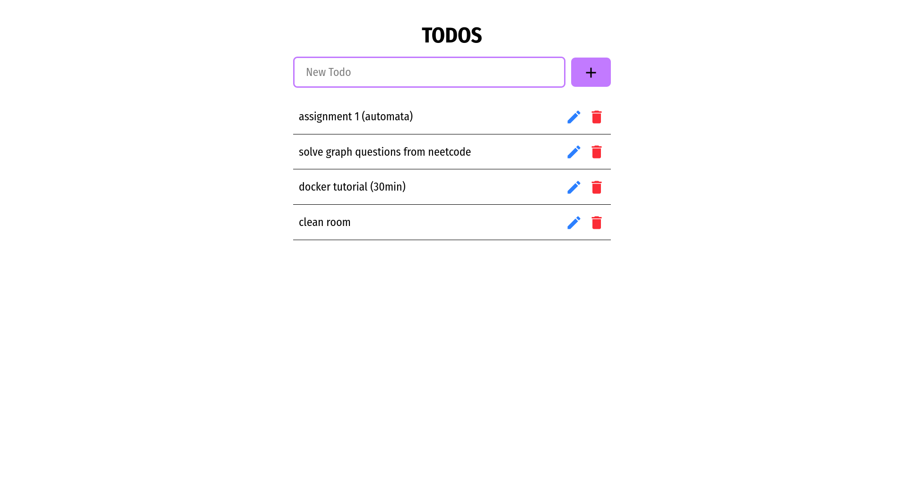

# Todo App (Fullstack)

A minimal fullstack Todo application built using **React**, **Node.js**, and **PostgreSQL**.

This project demonstrates how to build a CRUD (Create, Read, Update, Delete) app with separate backend and frontend codebases.

---

## 🚀 Features

* Add, view, update, and delete todos
* Minimal responsive UI with Tailwind CSS
* Backend API using Express and PostgreSQL
* Axios for handling API requests
* Error handling and async/await logic

---

## 📸 Preview

> 🖼️ Replace the image link below with your own screenshot:



---

## 🧱 Tech Stack

**Frontend:**

* React
* Axios
* Tailwind CSS

**Backend:**

* Node.js
* Express
* PostgreSQL (pg library)

---

## 📂 Project Structure

```
root/
├── backend/
│   ├── routes/
│   ├── controllers/
│   ├── config/
      ├── db.js
│   └── server.js
│
├── frontend/
│   ├── src/
│   ├── App.jsx
│   └── main.jsx
│
├── .gitignore
└── README.md
```

---

## 🔧 Getting Started

### Backend:

1. Navigate to backend:

```bash
cd backend
```

2. Install dependencies:

```bash
npm install
```

3. Setup your `.env`:

```env
PG_USER=your_db_user
PG_PASSWORD=your_db_password
PG_DB=your_db_name
PG_HOST=localhost
PG_PORT=5432
```

4. Start the server:

```bash
npm run dev
```

### Frontend:

1. Navigate to frontend:

```bash
cd frontend
```

2. Install dependencies:

```bash
npm install
```

3. Start the React app:

```bash
npm run dev
```

---

## 🌐 API Endpoints

| Method | Route       | Description         |
| ------ | ----------- | ------------------- |
| GET    | /todos      | Get all todos       |
| POST   | /todos      | Create a new todo   |
| DELETE | /todos/\:id | Delete a todo by ID |
| PUT    | /todos/\:id | Update a todo by ID |

